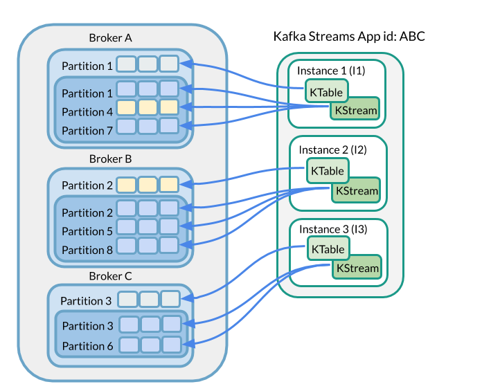
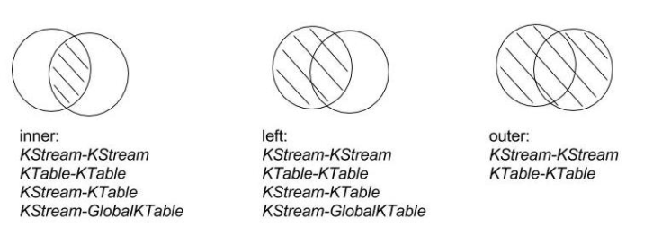

# KAFKA STREAMS

## KStream
A KStream is a stateless stream of key value pairs (similar to a kafka topic)

The records can come directly from a topic, or through some transformation.

## Ktable
A KTable is an abstraction on a kafka topic with only its latests key/value pairs.
The topic is therefore often compacted. We use KTables to join streams controllably.

## Global KTable
When the topics are not co-partitioned (topics have different number of partitions), we cannot use a KTable.

A Global KTable will replicate all underlying topic partitions on each instance of kafka-streams.
This will take up more disk space, increase disk i/o and use more time on repartitioning/syncing.

## Joins

|   Primary Type    | Secondary Type  | Inner Join | Left Join | Outer Join |
|:-----------------:|:---------------:|:----------:|:---------:|:----------:|
|      KStream      |     KStream     | Supported  | Supported | Supported  |
|      KTable       |     KTable      | Supported  | Supported | Supported  |
|      KStream      |     KTable      | Supported  | Supported |    N/A     |
|      KStream      |  Global KTable  | Supported  | Supported |    N/A     |

Joins can be done with or without windows (a time frame).
